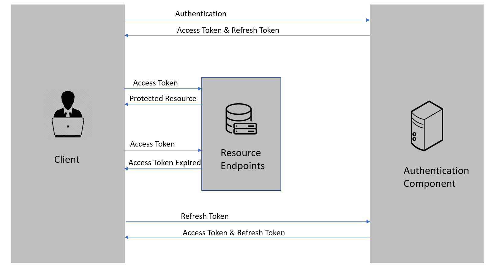

# Linger.AspNetCore.Jwt

Lightweight helpers for issuing and refreshing JWT access tokens in ASP.NET Core, focusing on "simple integration + extensibility + security best practices".

## Table of Contents
- [Features](#features)
- [Platform](#platform)
- [Installation](#installation)
- [Quick Start (Minimal Code)](#quick-start-minimal-code)
- [JwtOption Configuration](#jwtoption-configuration)
- [Registration & Integration](#registration--integration)
- [Custom Claims](#custom-claims)
- [Enable Refresh Tokens](#enable-refresh-tokens)
- [Controller Example](#controller-example)
- [Refresh Token Workflow Explained](#refresh-token-workflow-explained)
- [Security Best Practices](#security-best-practices)
- [Advanced Features](#advanced-features)
- [Troubleshooting](#troubleshooting)
- [FAQ](#faq)

## Features
- ✅ Interface separation: `IJwtService` only issues access tokens; refresh logic is decoupled via extension interface
- ✅ Progressive enhancement: Enable refresh tokens / auto-refresh on demand
- ✅ Pluggable storage: Memory, database, or custom implementation
- ✅ Resilience support: Concurrent-safe refresh based on `Microsoft.Extensions.Http.Resilience`
- ✅ Security hardening: Supports jti / iat, externalized keys, principle of least privilege
- ✅ Extensible: Override `GetClaimsAsync` to add roles / permissions / tenants

## Platform
.NET 8.0+ ASP.NET Core

## Installation
```bash
dotnet add package Linger.AspNetCore.Jwt
```
> Client auto-refresh requires additional packages: `Linger.HttpClient.Contracts`, `Linger.HttpClient.Standard`, `Microsoft.Extensions.Http.Resilience`

## Quick Start (Minimal Code)
```csharp
// Program.cs
var builder = WebApplication.CreateBuilder(args);
// 1. Bind configuration + register authentication scheme
builder.Services.ConfigureJwt(builder.Configuration);
// 2. Basic service
builder.Services.AddScoped<IJwtService, JwtService>();
// 3. Middleware
var app = builder.Build();
app.UseAuthentication();
app.UseAuthorization();
// 4. Login endpoint
app.MapPost("/login", async (IJwtService jwt, LoginModel m) =>
{
    if (!UserValidator.Validate(m.Username, m.Password)) return Results.Unauthorized();
    return Results.Ok(await jwt.CreateTokenAsync(m.Username));
});
app.Run();
```
> At this point: You have basic JWT capability; for refresh support → see "Enable Refresh Tokens" below.

## JwtOption Configuration
```csharp
public class JwtOption
{
    public string SecurityKey { get; set; } = null!; // ⚠️ MUST set in production!
    public string Issuer { get; set; } = "Linger.com";
    public string Audience { get; set; } = "Linger.com";
    public int ExpiresInMinutes { get; set; } = 30;               // Access token expiration (minutes)
    public int RefreshTokenExpiresInMinutes { get; set; } = 10080;    // Refresh token expiration (minutes, 7 days)
    public bool EnableRefreshToken { get; set; } = true;  // Whether to enable refresh support
}
```
`appsettings.json`:
```json
{
  "JwtOptions": {
    "SecurityKey": "At-least-32-character-production-key (override with SECRET env var)",
    "Issuer": "your-app.com",
    "Audience": "your-api.com",
    "ExpiresInMinutes": 15,
    "RefreshTokenExpiresInMinutes": 10080,
    "EnableRefreshToken": true
  }
}
```
Environment variable example:
```bash
# Linux / macOS
export SECRET="Prod_YourLongSecret_AtLeast32Chars"
# Windows PowerShell
$Env:SECRET = "Prod_YourLongSecret_AtLeast32Chars"
```

## Registration & Integration
```csharp
// Concise approach
builder.Services.ConfigureJwt(builder.Configuration);

// Manual binding + multi-authentication coexistence
var opt = builder.Configuration.GetGeneric<JwtOption>("JwtOptions");
ArgumentNullException.ThrowIfNull(opt);
builder.Services.AddSingleton(opt);
builder.Services.AddAuthentication(o =>
{
    o.DefaultAuthenticateScheme = CookieAuthenticationDefaults.AuthenticationScheme;
})
.AddCookie()
.AddJwtBearer(opt); // Extension

// Optional implementation injection
builder.Services.AddScoped<IJwtService, JwtService>();
builder.Services.AddScoped<IJwtService, CustomJwtService>();
builder.Services.AddScoped<IRefreshableJwtService, MemoryCachedJwtService>();
builder.Services.AddScoped<IJwtService>(sp => sp.GetRequiredService<IRefreshableJwtService>());
builder.Services.AddScoped<IRefreshableJwtService, DbJwtService>();
```

## Custom Claims
Default:
```csharp
protected virtual Task<List<Claim>> GetClaimsAsync(string userId) =>
    Task.FromResult(new List<Claim>{ new(ClaimTypes.Name, userId) });
```
Custom:
```csharp
public class CustomJwtService(AppDbContext db, JwtOption opt, ILogger? logger = null) : JwtService(opt, logger)
{
    protected override async Task<List<Claim>> GetClaimsAsync(string userId)
    {
        var claims = new List<Claim>{ new(ClaimTypes.Name, userId) };
        var user = await db.Users.FindAsync(userId);
        foreach (var role in user.Roles.Split(','))
            claims.Add(new Claim(ClaimTypes.Role, role));
        return claims;
    }
}
```

## Enable Refresh Tokens
Inherit from the abstract `JwtServiceWithRefresh` and implement storage:
```csharp
public class MemoryCachedJwtService : JwtServiceWithRefresh
{
    private readonly IMemoryCache _cache;
    public MemoryCachedJwtService(JwtOption opt, IMemoryCache cache, ILogger<MemoryCachedJwtService>? logger = null) : base(opt, logger) => _cache = cache;
    protected override Task HandleRefreshToken(string userId, JwtRefreshToken token)
    {
        _cache.Set($"RT_{userId}", token, TimeSpan.FromMinutes(_jwtOptions.RefreshTokenExpiresInMinutes));
        return Task.CompletedTask;
    }
    protected override Task<JwtRefreshToken> GetExistRefreshTokenAsync(string userId)
    {
        if (_cache.TryGetValue($"RT_{userId}", out JwtRefreshToken? token) && token is not null)
            return Task.FromResult(token);
        throw new Exception("Refresh token not found or expired");
    }
}
```
Database example (excerpt):
```csharp
public class DbJwtService : JwtServiceWithRefresh
{
    private readonly IUserRepository _repo;
    public DbJwtService(JwtOption opt, IUserRepository repo, ILogger<DbJwtService>? logger = null) : base(opt, logger) => _repo = repo;
    protected override Task HandleRefreshToken(string userId, JwtRefreshToken token)
        => _repo.UpdateRefreshTokenAsync(userId, token.RefreshToken, token.ExpiryTime);
    protected override async Task<JwtRefreshToken> GetExistRefreshTokenAsync(string userId)
    {
        var user = await _repo.GetUserAsync(userId);
        if (user is not null && !string.IsNullOrEmpty(user.RefreshToken))
            return new JwtRefreshToken { RefreshToken = user.RefreshToken, ExpiryTime = user.RefreshTokenExpiryTime };
        throw new Exception("Refresh token not found or expired");
    }
}
```

## Controller Example

### Recommended Approach (using RefreshTokenResultAsync)
```csharp
public class AuthController(IJwtService jwt, IUserService users) : ControllerBase
{
    [HttpPost("login")] 
    public async Task<IActionResult> Login(LoginModel m)
    { 
        var id = await users.ValidateUserAsync(m.Username, m.Password); 
        if (string.IsNullOrEmpty(id)) return Unauthorized(); 
        return Ok(await jwt.CreateTokenAsync(id)); 
    }
    
    [HttpPost("refresh")] 
    public async Task<IActionResult> Refresh(Token token)
    { 
        var result = await jwt.RefreshTokenResultAsync(token);
        if (result.Success) 
            return Ok(result.Token);
        
        return Unauthorized(result.ErrorMessage);
    }
}
```

> **💡 Tip**: `TryRefreshTokenAsync` is obsolete, please use `RefreshTokenResultAsync` instead.

### Alternative Approach (using exception handling)
```csharp
[HttpPost("refresh")] 
public async Task<IActionResult> Refresh(Token token)
{ 
    if (!jwt.SupportsRefreshToken()) 
        return Unauthorized("Refresh token not supported");
    
    try 
    {
        return Ok(await jwt.RefreshTokenAsync(token));
    }
    catch (NotSupportedException)
    {
        return Unauthorized("Refresh token not supported");
    }
    catch (SecurityTokenException ex)
    {
        _logger.LogWarning(ex, "Refresh token validation failed");
        return Unauthorized("Invalid or expired refresh token, please re-login");
    }
}
```

> **💡 Tip**: `RefreshTokenResultAsync` follows the result pattern, avoiding exception overhead for better performance and cleaner code.

---

## Refresh Token Workflow Explained
### What is a Refresh Token?

A refresh token is a credential that can be used to obtain new access tokens. When an access token expires, we can use the refresh token to get a new access token from the authentication component.

Feature comparison:
- **Access Token**: Short expiration (typically minutes), stored on client
- **Refresh Token**: Long expiration (typically days), stored on server database

### Token Usage Flow



1. Client authenticates by providing credentials (e.g., username and password)
2. Server issues access token and refresh token after successful validation
3. Client uses access token to request protected resources
4. Server validates access token and provides resources
5. Repeat steps 3-4 until access token expires
6. After access token expires, client uses refresh token to request new tokens
7. Server validates refresh token and issues new access token and refresh token
8. Repeat steps 3-7 until refresh token expires
9. After refresh token expires, client needs to re-authenticate completely (step 1)

### Why Do We Need Refresh Tokens?

So why do we need both access tokens and refresh tokens? Why don't we just set a long expiration date for the access token, like a month or a year? Because if we do that and someone manages to get our access token, they can use it for a long time even if we change our password!

The idea behind refresh tokens is that we can make the access token's lifetime very short, so even if it's compromised, the attacker only has access for a short period. With a refresh token-based flow, the authentication server issues a single-use refresh token along with the access token. The application securely stores the refresh token.

Every time the application sends a request to the server, it sends the access token in the Authorization header, and the server can identify the application using it. Once the access token expires, the server will send a token expired response. After receiving the token expired response, the application sends the expired access token and refresh token to get new access and refresh tokens.

If something goes wrong, the refresh token can be revoked, meaning when the application tries to use it to get a new access token, the request will be denied, and the user must re-enter their credentials and authenticate.

Therefore, refresh tokens help smooth authentication workflows without requiring users to frequently submit their credentials, while not compromising application security.

## Security Best Practices
- Use environment variable SECRET to override config key (length ≥ 32)
- Short-lived access tokens + longer-lived refresh tokens, revoke promptly
- Hash persisted refresh tokens (prevent leak abuse)
- Record jti / iat for revocation and auditing
- Clear local state immediately on failed refresh

## Advanced Features
- jti / iat claims → Auditing and replay prevention
- Custom Claims (roles / permissions / tenants / policy tags)
- Multiple storage backends: Memory / Database / Distributed cache
- Combined Resilience: Retry + Refresh + Circuit breaker + Timeout

## Troubleshooting
| Symptom | Possible Cause | Suggested Fix |
|---------|----------------|---------------|
| 401 immediately after successful login | Time out of sync / Signature failure | Sync time; unify SECRET |
| Refresh not triggering | Not enabled/registered refresh implementation | Check EnableRefreshToken & DI |
| Refresh storm | Concurrent 401 race condition | Use semaphore/single refresh control |
| Refresh succeeds but still old token | Client not updating headers | Confirm event subscription and SetToken call |
| Invalid signature | Inconsistent keys across instances | Use config center or unified env variable |

## FAQ
**Q:** Must I enable refresh tokens?  **A:** No, you can use short-lived tokens only.

**Q:** How to revoke all tokens for a user?  **A:** Record jti, add to blacklist; delete refresh token record.

**Q:** How to support multi-tenancy?  **A:** Add tenant Claim, and validate in authorization policy.

**Q:** Can I extend the return model?  **A:** Yes, wrap DTO in custom implementation.

**Q:** How to prevent refresh token theft?  **A:** Store hash on server, client only holds random value, enable HTTPS and minimal persistence.
