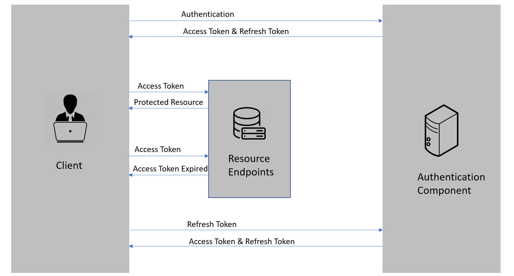

# Linger.AspNetCore.Jwt

Lightweight helpers for issuing and refreshing JWT access tokens in ASP.NET Core, focusing on "simple integration + extensibility + security best practices".

> Upgrading from 1.x? See the [2.0 migration guide](https://github.com/Linger06/Linger/blob/v2.0.0-preview.1/src/Linger/MIGRATION.md).

## Table of Contents
- [Features](#features)
- [Platform](#platform)
- [Installation](#installation)
- [Quick Start (Minimal Code)](#quick-start-minimal-code)
- [JwtOption Configuration](#jwtoption-configuration)
- [Registration & Integration](#registration--integration)
- [Custom Claims](#custom-claims)
- [Enable Refresh Tokens](#enable-refresh-tokens)
- [Controller Example](#controller-example)
- [Automatic refresh on clients](#automatic-refresh-on-clients)
- [Refresh Token Workflow Explained](#refresh-token-workflow-explained)
- [Security Best Practices](#security-best-practices)
- [Advanced Features](#advanced-features)
- [Troubleshooting](#troubleshooting)
- [FAQ](#faq)

## Features
- ✅ Interface separation: `IJwtService` only issues access tokens; refresh logic is decoupled via extension interface
- ✅ Progressive enhancement: Enable refresh tokens on demand
- ✅ Pluggable storage: Memory, database, or custom implementation
- ✅ Security hardening: Supports jti / iat, externalized keys, principle of least privilege
- ✅ Extensible: Override `GetClaimsAsync` to add roles / permissions / tenants

## Platform
.NET 8.0+ ASP.NET Core

## Installation
```bash
dotnet add package Linger.AspNetCore.Jwt
```
> The client auto-refresh example additionally requires `Linger.HttpClient.Standard` and `Linger.AspNetCore.Jwt.Contracts`.

## Quick Start (Minimal Code)
```csharp
// Program.cs
var builder = WebApplication.CreateBuilder(args);
// 1. Bind configuration + register authentication scheme
builder.Services.ConfigureJwt(builder.Configuration);
// 2. Basic service
builder.Services.AddScoped<IJwtService, JwtService>();
// 3. Middleware
var app = builder.Build();
app.UseAuthentication();
app.UseAuthorization();
// 4. Login endpoint
app.MapPost("/login", async (IJwtService jwt, LoginModel m) =>
{
    if (!UserValidator.Validate(m.Username, m.Password)) return Results.Unauthorized();
    return Results.Ok(await jwt.CreateTokenAsync(m.Username));
});
app.Run();
```
> At this point: You have basic JWT capability; for refresh support → see "Enable Refresh Tokens" below.

## JwtOption Configuration
```csharp
public class JwtOption
{
    public string SecurityKey { get; init; } = string.Empty;
    public string Issuer { get; init; } = string.Empty;
    public string Audience { get; init; } = string.Empty;
    public int ExpiresInMinutes { get; init; } = 30;
    public int RefreshTokenExpiresInMinutes { get; init; } = 10080;
}
```
`appsettings.json`:
```json
{
  "JwtOptions": {
    "SecurityKey": "At-least-32-character-production-key (override with SECRET env var)",
    "Issuer": "your-app.com",
    "Audience": "your-api.com",
    "ExpiresInMinutes": 15,
    "RefreshTokenExpiresInMinutes": 10080
  }
}
```
Environment variable example:
```bash
# Linux / macOS
export SECRET="Prod_YourLongSecret_AtLeast32Chars"
# Windows PowerShell
$Env:SECRET = "Prod_YourLongSecret_AtLeast32Chars"
```

## Registration & Integration
```csharp
// Concise approach
builder.Services.ConfigureJwt(builder.Configuration);

// Manual binding + multi-authentication coexistence
var opt = builder.Configuration.GetGeneric<JwtOption>("JwtOptions");
ArgumentNullException.ThrowIfNull(opt);
builder.Services.AddSingleton(opt);
builder.Services.AddAuthentication(o =>
{
    o.DefaultAuthenticateScheme = CookieAuthenticationDefaults.AuthenticationScheme;
})
.AddCookie()
.AddJwtBearer(opt); // Extension

// Optional implementation injection
builder.Services.AddScoped<IJwtService, JwtService>();

// For refresh tokens, register one implementation with atomic rotation
builder.Services.AddScoped<IRefreshableJwtService, DbJwtService>();
builder.Services.AddScoped<IJwtService>(provider =>
    provider.GetRequiredService<IRefreshableJwtService>());
```

The basic service and refresh service are alternative registrations. Do not register several `IJwtService` implementations together. `AddJwtBearer` retains diagnostic response headers for common token failures and uses the standard ASP.NET Core `401` / `403` responses without returning internal exception details.

## Custom Claims
Default:
```csharp
protected virtual Task<List<Claim>> GetClaimsAsync(
    string userId,
    CancellationToken cancellationToken) =>
    Task.FromResult(new List<Claim>{ new(ClaimTypes.Name, userId) });
```
Custom:
```csharp
public class CustomJwtService(AppDbContext db, JwtOption opt, ILogger? logger = null) : JwtService(opt, logger)
{
    protected override async Task<List<Claim>> GetClaimsAsync(
        string userId,
        CancellationToken cancellationToken)
    {
        var claims = new List<Claim> { new(ClaimTypes.Name, userId) };
        var user = await db.Users.FindAsync([userId], cancellationToken);
        foreach (var role in user.Roles.Split(','))
        {
            claims.Add(new Claim(ClaimTypes.Role, role));
        }

        return claims;
    }
}
```

## Enable Refresh Tokens
Inherit from `JwtServiceWithRefresh` and implement initial storage and atomic rotation separately. This in-memory example uses a process-local lock so one old token can succeed only once:
```csharp
public class MemoryCachedJwtService : JwtServiceWithRefresh
{
    private readonly IMemoryCache _cache;
    private readonly object _rotationLock = new();

    public MemoryCachedJwtService(
        JwtOption options,
        IMemoryCache cache,
        ILogger<MemoryCachedJwtService>? logger = null) : base(options, logger)
    {
        _cache = cache;
    }

    protected override Task StoreRefreshTokenAsync(
        string userId,
        JwtRefreshToken refreshToken,
        CancellationToken cancellationToken)
    {
        cancellationToken.ThrowIfCancellationRequested();
        _cache.Set($"RT_{userId}", refreshToken, refreshToken.ExpiryTime);

        return Task.CompletedTask;
    }

    protected override Task<bool> TryRotateRefreshTokenAsync(
        string userId,
        string presentedRefreshToken,
        JwtRefreshToken replacement,
        CancellationToken cancellationToken)
    {
        cancellationToken.ThrowIfCancellationRequested();
        lock (_rotationLock)
        {
            if (!_cache.TryGetValue($"RT_{userId}", out JwtRefreshToken? current) ||
                current is null ||
                current.ExpiryTime <= DateTime.UtcNow ||
                !string.Equals(current.RefreshToken, presentedRefreshToken, StringComparison.Ordinal))
            {
                return Task.FromResult(false);
            }

            _cache.Set($"RT_{userId}", replacement, replacement.ExpiryTime);

            return Task.FromResult(true);
        }
    }
}
```

The lock in the memory example is process-local. Multi-instance deployments must use a database transaction or an atomic compare-and-replace primitive provided by a distributed cache.

A database implementation must compare and replace through one conditional update or transaction. Do not split `TryRotateRefreshTokenAsync` back into a query followed by an update:

```csharp
public class DbJwtService : JwtServiceWithRefresh
{
    private readonly IUserRepository _repo;

    public DbJwtService(
        JwtOption options,
        IUserRepository repo,
        ILogger<DbJwtService>? logger = null) : base(options, logger)
    {
        _repo = repo;
    }

    protected override Task StoreRefreshTokenAsync(
        string userId,
        JwtRefreshToken refreshToken,
        CancellationToken cancellationToken) =>
        _repo.StoreRefreshTokenAsync(userId, refreshToken, cancellationToken);

    protected override Task<bool> TryRotateRefreshTokenAsync(
        string userId,
        string presentedRefreshToken,
        JwtRefreshToken replacement,
        CancellationToken cancellationToken) =>
        _repo.TryRotateRefreshTokenAsync(
            userId,
            presentedRefreshToken,
            replacement,
            cancellationToken);
}
```

`TryRotateRefreshTokenAsync` returns `true` only when the stored token matched, had not expired, and was replaced atomically. A database can use a conditional `UPDATE` containing the user ID, old token, and expiration constraints, then check the affected row count.

## Controller Example

### Recommended Approach (using RefreshTokenResultAsync)
```csharp
public class AuthController(IJwtService jwt, IUserService users) : ControllerBase
{
    [HttpPost("login")] 
    public async Task<IActionResult> Login(LoginModel m, CancellationToken cancellationToken)
    { 
        var id = await users.ValidateUserAsync(m.Username, m.Password); 
        if (string.IsNullOrEmpty(id)) return Unauthorized(); 
        return Ok(await jwt.CreateTokenAsync(id, cancellationToken));
    }
    
    [HttpPost("refresh")] 
    public async Task<IActionResult> Refresh(Token token, CancellationToken cancellationToken)
    { 
        var result = await jwt.RefreshTokenResultAsync(token, cancellationToken);
        if (result.Success) 
            return Ok(result.Token);
        
        return Unauthorized(result.ErrorMessage);
    }
}
```

### Alternative Approach (using exception handling)
```csharp
[HttpPost("refresh")] 
public async Task<IActionResult> Refresh(Token token, CancellationToken cancellationToken)
{ 
    if (!jwt.SupportsRefreshToken()) 
        return Unauthorized("Refresh token not supported");
    
    try 
    {
        return Ok(await jwt.RefreshTokenAsync(token, cancellationToken));
    }
    catch (NotSupportedException)
    {
        return Unauthorized("Refresh token not supported");
    }
    catch (SecurityTokenException ex)
    {
        _logger.LogWarning(ex, "Refresh token validation failed");
        return Unauthorized("Invalid or expired refresh token, please re-login");
    }
}
```

`RefreshTokenResultAsync` converts only expected invalid-token exceptions into a failed result. Cancellation and unexpected storage failures continue to propagate.

### Automatic refresh on clients

`Linger.AspNetCore.Jwt` validates and rotates refresh tokens on the server, but it does not manipulate `HttpClient` instances in desktop or other client applications. Retain the complete `Token` returned by login or refresh, call the `refresh` endpoint before the access token expires, and replace both the access token and refresh token with the returned values.

When constructing `StandardHttpClient` directly in WinForms, a `DelegatingHandler` can check and refresh the token before sending a request. See the [Linger.HttpClient.Standard README](../Linger.HttpClient.Standard/README.md) for the complete implementation, including concurrent-refresh coordination, the separate refresh client, and returning to sign-in after refresh failure.

---

## Refresh Token Workflow Explained
### What is a Refresh Token?

A refresh token is a credential that can be used to obtain new access tokens. When an access token expires, we can use the refresh token to get a new access token from the authentication component.

Feature comparison:
- **Access Token**: Short expiration (typically minutes), stored on client
- **Refresh Token**: Long expiration (typically days), stored on server database

### Token Usage Flow



1. Client authenticates by providing credentials (e.g., username and password)
2. Server issues access token and refresh token after successful validation
3. Client uses access token to request protected resources
4. Server validates access token and provides resources
5. Repeat steps 3-4 until access token expires
6. After access token expires, client uses refresh token to request new tokens
7. Server validates refresh token and issues new access token and refresh token
8. Repeat steps 3-7 until refresh token expires
9. After refresh token expires, client needs to re-authenticate completely (step 1)

### Why Do We Need Refresh Tokens?

So why do we need both access tokens and refresh tokens? Why don't we just set a long expiration date for the access token, like a month or a year? Because if we do that and someone manages to get our access token, they can use it for a long time even if we change our password!

The idea behind refresh tokens is that we can make the access token's lifetime very short, so even if it's compromised, the attacker only has access for a short period. With a refresh token-based flow, the authentication server issues a single-use refresh token along with the access token. The application securely stores the refresh token.

Every time the application sends a request to the server, it sends the access token in the Authorization header, and the server can identify the application using it. Once the access token expires, the server will send a token expired response. After receiving the token expired response, the application sends the expired access token and refresh token to get new access and refresh tokens.

If something goes wrong, the refresh token can be revoked, meaning when the application tries to use it to get a new access token, the request will be denied, and the user must re-enter their credentials and authenticate.

Therefore, refresh tokens help smooth authentication workflows without requiring users to frequently submit their credentials, while not compromising application security.

## Security Best Practices
- Use environment variable SECRET to override config key (length ≥ 32)
- Short-lived access tokens + longer-lived refresh tokens, revoke promptly
- Hash persisted refresh tokens (prevent leak abuse)
- Record jti / iat for revocation and auditing
- Clear local state immediately on failed refresh

## Advanced Features
- jti / iat claims → Auditing and replay prevention
- Custom Claims (roles / permissions / tenants / policy tags)
- Multiple storage backends: Memory / Database / Distributed cache
- Combined Resilience: Retry + Refresh + Circuit breaker + Timeout

## Troubleshooting
| Symptom | Possible Cause | Suggested Fix |
|---------|----------------|---------------|
| 401 immediately after successful login | Time out of sync / Signature failure | Sync time; unify SECRET |
| Refresh not triggering | Refresh implementation is not registered | Check the `IRefreshableJwtService` and `IJwtService` DI mapping |
| Refresh storm | Concurrent 401 race condition | Use semaphore/single refresh control |
| Refresh succeeds but still old token | Client not updating headers | Confirm event subscription and SetToken call |
| Invalid signature | Inconsistent keys across instances | Use config center or unified env variable |

## FAQ
**Q:** Must I enable refresh tokens?  **A:** No, you can use short-lived tokens only.

**Q:** How to revoke all tokens for a user?  **A:** Record jti, add to blacklist; delete refresh token record.

**Q:** How to support multi-tenancy?  **A:** Add tenant Claim, and validate in authorization policy.

**Q:** Can I extend the return model?  **A:** Yes, wrap DTO in custom implementation.

**Q:** How to prevent refresh token theft?  **A:** Store hash on server, client only holds random value, enable HTTPS and minimal persistence.
