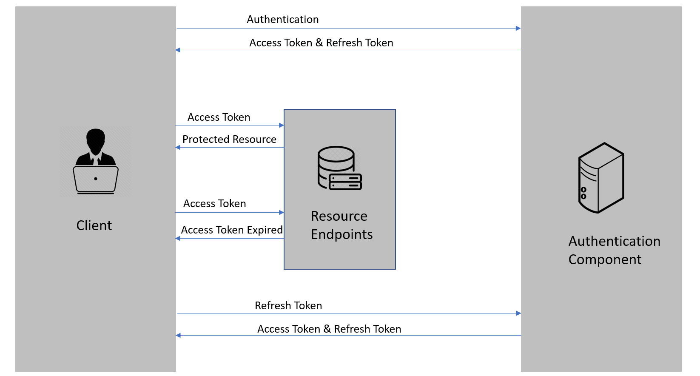

# Linger.AspNetCore.Jwt

> 📝 *查看此文档：[English](./README.md) | [中文](./README.zh-CN.md)*

一个用于处理JWT令牌认证的C#辅助库，支持灵活的刷新令牌实现。

## 支持的 .NET 版本

本库支持在.NET 8.0+上运行的ASP.NET Core应用程序。

## 设计特点

本库采用扩展方法实现方式处理刷新令牌功能，主要优势如下：

- **接口隔离**：核心`IJwtService`接口保持简洁，只包含基本令牌生成功能
- **功能扩展**：通过`IRefreshableJwtService`接口和扩展方法提供刷新令牌功能
- **灵活使用**：可以根据不同场景选择使用基本JWT认证或带刷新令牌的认证
- **兼容性好**：不破坏现有代码结构，易于集成到已有项目

## 使用指南

### 1. 配置JWT选项

`JwtOption`类提供了JWT令牌生成和验证的配置设置：

```csharp
public class JwtOption
{
    // JWT签名密钥（在生产环境中应存储在安全位置）
    public string SecurityKey { get; set; } = "this is my custom Secret key for authentication";
    
    // 令牌颁发者（通常是您的应用程序或认证服务器域名）
    public string Issuer { get; set; } = "Linger.com";
    
    // 令牌受众（通常是您的API域名）
    public string Audience { get; set; } = "Linger.com";
    
    // 访问令牌过期时间，单位分钟（默认：30分钟）
    public int Expires { get; set; } = 30;
    
    // 刷新令牌过期时间，单位分钟（默认：60分钟）
    public int RefreshTokenExpires { get; set; } = 60;
    
    // 启用/禁用刷新令牌功能的标志
    public bool EnableRefreshToken { get; set; } = true;
}
```

在`appsettings.json`文件中配置JWT选项：

```json
{
  "JwtOptions": {
    "SecurityKey": "您的安全密钥，至少256位",
    "Issuer": "your-app.com",
    "Audience": "your-api.com",
    "Expires": 15,
    "RefreshTokenExpires": 10080, // 7天
    "EnableRefreshToken": true
  }
}
```

### 2. 实现您的自定义JWT服务

由于`JwtServiceWithRefresh`是一个抽象类，您需要继承它并实现抽象方法来处理刷新令牌的存储和获取：

```csharp
// 使用内存缓存的实现示例
public class MemoryCachedJwtService : JwtServiceWithRefresh
{
    private readonly IMemoryCache _cache;

    public MemoryCachedJwtService(JwtOption jwtOptions, IMemoryCache cache, ILogger<MemoryCachedJwtService>? logger = null) 
        : base(jwtOptions, logger)
    {
        _cache = cache;
    }

    protected override Task HandleRefreshToken(string userId, JwtRefreshToken refreshToken)
    {
        // 将刷新令牌存储在内存缓存中
        _cache.Set($"RT_{userId}", refreshToken, TimeSpan.FromMinutes(_jwtOptions.RefreshTokenExpires));
        return Task.CompletedTask;
    }

    protected override Task<JwtRefreshToken> GetExistRefreshTokenAsync(string userId)
    {
        // 从内存缓存中获取刷新令牌
        if (_cache.TryGetValue($"RT_{userId}", out JwtRefreshToken? token) && token != null)
        {
            return Task.FromResult(token);
        }
        
        throw new Exception("刷新令牌未找到或已过期");
    }
}

// 使用数据库的实现示例
public class DbJwtService : JwtServiceWithRefresh
{
    private readonly IUserRepository _userRepository;

    public DbJwtService(JwtOption jwtOptions, IUserRepository userRepository, ILogger<DbJwtService>? logger = null) 
        : base(jwtOptions, logger)
    {
        _userRepository = userRepository;
    }

    protected override async Task HandleRefreshToken(string userId, JwtRefreshToken refreshToken)
    {
        // 将刷新令牌存储在数据库中
        await _userRepository.UpdateRefreshTokenAsync(userId, refreshToken.RefreshToken, refreshToken.ExpiryTime);
    }

    protected override async Task<JwtRefreshToken> GetExistRefreshTokenAsync(string userId)
    {
        // 从数据库中获取刷新令牌
        var user = await _userRepository.GetUserAsync(userId);
        if (user != null && !string.IsNullOrEmpty(user.RefreshToken))
        {
            return new JwtRefreshToken
            {
                RefreshToken = user.RefreshToken,
                ExpiryTime = user.RefreshTokenExpiryTime
            };
        }
        
        throw new Exception("刷新令牌未找到或已过期");
    }
}
```

### 3. 注册服务

在`Program.cs`或`Startup.cs`中注册JWT服务：

```csharp
// 从appsettings.json添加JWT配置
services.Configure<JwtOption>(Configuration.GetSection("JwtOptions"));

// 注册为单例以确保配置一致性
services.AddSingleton(sp => sp.GetRequiredService<IOptions<JwtOption>>().Value);

// 注册JWT服务 - 选择以下选项之一：

// 选项1：基本服务（无刷新令牌）
services.AddScoped<IJwtService, JwtService>();

// 选项2：支持刷新令牌的服务（使用内存缓存）
services.AddScoped<IRefreshableJwtService, MemoryCachedJwtService>();
// 同时注册为基础接口，允许通过IJwtService访问
services.AddScoped<IJwtService>(sp => sp.GetRequiredService<IRefreshableJwtService>());

// 选项3：支持刷新令牌的服务（使用数据库）
services.AddScoped<IRefreshableJwtService, DbJwtService>();
services.AddScoped<IJwtService>(sp => sp.GetRequiredService<IRefreshableJwtService>());
```

### 4. 在控制器中使用

在控制器中实现认证：

```csharp
// 方式1：只使用基本功能时
public class BasicAuthController : ControllerBase
{
    private readonly IJwtService _jwtService;
    
    public BasicAuthController(IJwtService jwtService)
    {
        _jwtService = jwtService;
    }
    
    [HttpPost("login")]
    public async Task<IActionResult> Login([FromBody] LoginModel model)
    {
        // 验证用户凭据...
        string userId = await _userService.ValidateUserAsync(model.Username, model.Password);
        if (string.IsNullOrEmpty(userId))
        {
            return Unauthorized();
        }
        
        var token = await _jwtService.CreateTokenAsync(userId);
        return Ok(token);
    }
    
    [HttpPost("refresh")]
    public async Task<IActionResult> RefreshToken([FromBody] Token token)
    {
        // 利用扩展方法检查是否支持刷新功能
        if (_jwtService.SupportsRefreshToken())
        {
            var (success, newToken) = await _jwtService.TryRefreshTokenAsync(token);
            if (success)
            {
                return Ok(newToken);
            }
        }
        
        return Unauthorized("请重新登录");
    }
}

// 方式2：直接使用具有刷新功能的接口
public class RefreshableAuthController : ControllerBase
{
    private readonly IRefreshableJwtService _jwtService;
    
    public RefreshableAuthController(IRefreshableJwtService jwtService)
    {
        _jwtService = jwtService;
    }
    
    [HttpPost("login")]
    public async Task<IActionResult> Login([FromBody] LoginModel model)
    {
        // 验证用户凭据...
        string userId = await _userService.ValidateUserAsync(model.Username, model.Password);
        if (string.IsNullOrEmpty(userId))
        {
            return Unauthorized();
        }
        
        var token = await _jwtService.CreateTokenAsync(userId);
        return Ok(token);
    }
    
    [HttpPost("refresh")]
    public async Task<IActionResult> RefreshToken([FromBody] Token token)
    {
        try 
        {
            // 直接调用刷新方法，无需检查支持与否
            var newToken = await _jwtService.RefreshTokenAsync(token);
            return Ok(newToken);
        }
        catch (Exception ex)
        {
            return Unauthorized($"刷新令牌失败: {ex.Message}");
        }
    }
}
```

## 客户端自动令牌刷新

除了服务端实现令牌刷新外，客户端应用程序需要相应的机制来处理令牌过期和刷新。推荐的方法是使用Microsoft.Extensions.Http.Resilience，它比传统的拦截器方式提供了更加集成和健壮的解决方案。

### 安装必要的包

要在客户端使用自动令牌刷新功能，需要安装以下NuGet包：

```bash
# 安装HTTP客户端接口和契约
dotnet add package Linger.HttpClient.Contracts

# 安装HTTP客户端实现
dotnet add package Linger.HttpClient.Standard

# 安装Microsoft.Extensions.Http.Resilience用于处理重试和令牌刷新
dotnet add package Microsoft.Extensions.Http.Resilience
```

### 使用弹性管道实现令牌刷新

现代方法使用Microsoft.Extensions.Http.Resilience以线程安全和弹性的方式处理令牌刷新：

1. 首先，创建应用状态类来维护令牌状态：

```csharp
/// <summary>
/// 应用状态管理类，用于存储跨组件的应用状态
/// </summary>
public class AppState
{
    private string _token = string.Empty;
    
    /// <summary>
    /// 用户的JWT认证令牌
    /// </summary>
    public string? Token 
    { 
        get => _token;
        set 
        {
            _token = value ?? string.Empty;
            NotifyStateChanged();
        }
    }
    
    /// <summary>
    /// 用于获取新访问令牌的刷新令牌
    /// </summary>
    public string RefreshToken { get; set; } = string.Empty;
    
    /// <summary>
    /// 检查用户当前是否已认证
    /// </summary>
    public bool IsAuthenticated => !string.IsNullOrEmpty(Token);

    /// <summary>
    /// 令牌变化时触发的事件
    /// </summary>
    public event Action? OnChange;
    
    /// <summary>
    /// 需要重新登录时触发的事件
    /// </summary>
    public event Action? RequireRelogin;
    
    /// <summary>
    /// 通知状态变更
    /// </summary>
    private void NotifyStateChanged() => OnChange?.Invoke();
    
    /// <summary>
    /// 触发重新登录请求
    /// </summary>
    public void RaiseRequireReloginEvent()
    {
        RequireRelogin?.Invoke();
    }
}
```

2. 然后，创建一个令牌刷新处理器，管理令牌刷新过程：

```csharp
/// <summary>
/// 使用Microsoft.Extensions.Http.Resilience的令牌刷新处理器
/// </summary>
public class TokenRefreshHandler
{
    private readonly AppState _appState;
    private readonly IServiceProvider _serviceProvider;
    private readonly SemaphoreSlim _semaphore = new(1, 1);

    public TokenRefreshHandler(AppState appState, IServiceProvider serviceProvider)
    {
        _appState = appState;
        _serviceProvider = serviceProvider;
    }

    /// <summary>
    /// 配置令牌刷新弹性管道
    /// </summary>
    public void ConfigureTokenRefreshResiliencePipeline(ResiliencePipelineBuilder<HttpResponseMessage> builder)
    {
        // 添加处理401(Unauthorized)的弹性策略
        builder.AddRetry(new HttpRetryStrategyOptions
        {
            // 设置最大重试次数为1（只尝试刷新令牌一次）
            MaxRetryAttempts = 1,
            // 只有401错误才触发令牌刷新
            ShouldHandle = args => 
            {
                bool shouldRetry = args.Outcome.Result?.StatusCode == HttpStatusCode.Unauthorized;
                return ValueTask.FromResult(shouldRetry);
            },
            // 在重试前执行令牌刷新
            OnRetry = async context =>
            {
                // 使用信号量防止多个请求同时尝试刷新令牌
                await _semaphore.WaitAsync();
                try
                {
                    await RefreshTokenAsync();
                }
                finally
                {
                    _semaphore.Release();
                }
            },
            // 重试延迟设为0，令牌刷新后立即重试
            BackoffType = DelayBackoffType.Constant,
            Delay = TimeSpan.Zero
        });
    }

    /// <summary>
    /// 刷新令牌
    /// </summary>
    private async Task RefreshTokenAsync()
    {
        try
        {
            // 获取认证服务来刷新令牌
            using var scope = _serviceProvider.CreateScope();
            var authService = scope.ServiceProvider.GetRequiredService<AuthService>();

            // 使用当前令牌和刷新令牌获取新的令牌
            var (success, newToken) = await authService.RefreshTokenAsync(
                _appState.Token, 
                _appState.RefreshToken);

            if (success && !string.IsNullOrEmpty(newToken))
            {
                // 更新令牌
                _appState.Token = newToken;
                // Token属性setter会自动通知变更
            }
            else
            {
                // 如果刷新失败，清除令牌
                _appState.Token = string.Empty;
                _appState.RefreshToken = string.Empty;
                // 触发需要重新登录的事件
                _appState.RaiseRequireReloginEvent();
            }
        }
        catch (Exception ex)
        {
            Console.WriteLine($"令牌刷新失败: {ex.Message}");
            
            // 清除无效令牌
            _appState.Token = string.Empty;
            _appState.RefreshToken = string.Empty;
            
            // 触发重新登录事件
            _appState.RaiseRequireReloginEvent();
        }
    }
}
```

3. 实现一个认证服务，可以处理登录和令牌刷新：

```csharp
/// <summary>
/// 认证服务，使用IHttpClient处理登录、注销
/// </summary>
public class AuthService
{
    private readonly IHttpClient _httpClient;
    private readonly AppState _appState;
    private readonly ILogger<AuthService>? _logger;

    public AuthService(IHttpClient httpClient, AppState appState, ILogger<AuthService>? logger = null)
    {
        _httpClient = httpClient;
        _appState = appState;
        _logger = logger;
    }

    /// <summary>
    /// 登录方法
    /// </summary>
    public async Task<bool> LoginAsync(LoginRequest loginRequest, CancellationToken cancellationToken = default)
    {
        try
        {
            _logger?.LogInformation($"尝试登录用户: {loginRequest.Username}");

            // 直接使用IHttpClient发送POST请求
            var result = await _httpClient.CallApi<LoginResponse>(
                "api/auth/login",
                HttpMethodEnum.Post,
                postData: loginRequest,
                cancellationToken: cancellationToken);

            if (!result.IsSuccess)
            {
                _logger?.LogWarning($"登录失败: {result.ErrorMsg}");
                return false;
            }

            // 保存令牌和用户信息到应用状态
            _appState.Token = result.Data.Token;
            _appState.Username = loginRequest.Username;
            _appState.IsLoggedIn = true;

            _logger?.LogInformation($"用户 {loginRequest.Username} 登录成功");
            return true;
        }
        catch (Exception ex)
        {
            _logger?.LogError(ex, $"登录过程中发生异常: {ex.Message}");
            return false;
        }
    }

    /// <summary>
    /// 刷新令牌
    /// </summary>
    public async Task<(bool success, string newToken)> RefreshTokenAsync(string accessToken, string refreshToken)
    {
        try
        {
            // 创建刷新令牌请求的数据
            var refreshRequest = new
            {
                AccessToken = accessToken,
                RefreshToken = refreshToken
            };
            
            // 调用刷新令牌API
            var response = await _httpClient.CallApi<TokenResponse>(
                "api/auth/refresh", 
                HttpMethodEnum.Post, 
                refreshRequest);
                
            if (response.IsSuccess && response.Data != null)
            {
                return (true, response.Data.AccessToken);
            }
            
            return (false, string.Empty);
        }
        catch
        {
            return (false, string.Empty);
        }
    }
    
    /// <summary>
    /// 注销方法
    /// </summary>
    public Task<bool> Logout()
    {
        _logger?.LogInformation($"用户 {_appState.Username} 注销");

        // 清除令牌和用户信息
        _appState.Token = null;
        _appState.Username = string.Empty;
        _appState.IsLoggedIn = false;

        return Task.FromResult(true);
    }
    
    // 令牌响应模型
    private class TokenResponse
    {
        public string AccessToken { get; set; } = string.Empty;
        public string RefreshToken { get; set; } = string.Empty;
        public int ExpiresIn { get; set; }
    }
}
```

### 注册和使用

使用HttpClientFactory注册令牌刷新处理器并配置弹性：

```csharp
// 注册AppState
services.AddSingleton<AppState>();

// 注册令牌刷新处理器
services.AddSingleton<TokenRefreshHandler>();

// 注册HTTP客户端和服务
services.AddHttpClient<IHttpClient, StandardHttpClient>(client =>
{
    client.BaseAddress = new Uri("https://api.example.com/");
    client.DefaultRequestHeaders.Add("Accept", "application/json");
    client.Timeout = TimeSpan.FromSeconds(30);
})
.AddTypedClient<IHttpClient>((httpClient, serviceProvider) =>
{
    var standardClient = new StandardHttpClient(httpClient);

    // 从AppState设置令牌
    var appState = serviceProvider.GetRequiredService<AppState>();
    if (!string.IsNullOrEmpty(appState.Token))
    {
        standardClient.SetToken(appState.Token);
    }

    // 订阅令牌变化事件
    appState.OnChange += () =>
    {
        if (!string.IsNullOrEmpty(appState.Token))
        {
            standardClient.SetToken(appState.Token);
        }
    };

    return standardClient;
})
.AddResilienceHandler("Default", (builder, context) =>
{
    // 添加处理常见HTTP错误的标准重试策略
    builder.AddRetry(new HttpRetryStrategyOptions
    {
        MaxRetryAttempts = 3,
        Delay = TimeSpan.FromSeconds(2),
        ShouldHandle = args =>
        {
            return ValueTask.FromResult(args.Outcome.Result?.StatusCode is
                HttpStatusCode.RequestTimeout or        // 408
                HttpStatusCode.TooManyRequests or       // 429
                HttpStatusCode.BadGateway or            // 502
                HttpStatusCode.ServiceUnavailable or    // 503
                HttpStatusCode.GatewayTimeout);         // 504
        }
    });

    // 添加令牌刷新策略
    var tokenRefreshHandler = context.ServiceProvider.GetRequiredService<TokenRefreshHandler>();
    tokenRefreshHandler.ConfigureTokenRefreshResiliencePipeline(builder);
});

// 注册认证服务
services.AddScoped<AuthService>();
```

### 在不同客户端类型中处理重新登录

您需要根据客户端类型处理 `RequireReLogin` 事件：

#### 对于 Blazor 应用程序

```csharp
// 注入 AppState
@inject AppState AppState
@inject NavigationManager Navigation
@implements IDisposable

@code {
    protected override void OnInitialized()
    {
        // 订阅重新登录事件
        AppState.RequireRelogin += HandleRequireReLogin;
        base.OnInitialized();
    }

    private void HandleRequireReLogin()
    {
        // 重定向到登录页面
        Navigation.NavigateTo("/login", forceLoad: false);
    }

    public void Dispose()
    {
        // 取消订阅以防止内存泄漏
        AppState.RequireRelogin -= HandleRequireReLogin;
    }
}
```

#### 对于带Blazor WebView的WinForms应用程序

```csharp
public partial class MainForm : Form
{
    // 直接从服务获取AppState
    public MainForm()
    {
        InitializeComponent();
        
        // 其他初始化...
        
        // 从Blazor服务获取AppState
        var appState = blazorWebView.Services.GetRequiredService<AppState>();
        appState.RequireRelogin += HandleRequireReLogin;
    }
    
    private void HandleRequireReLogin()
    {
        // 需要在UI线程上调用，因为事件可能来自后台线程
        this.Invoke((MethodInvoker)delegate
        {
            // 显示登录窗体
            var loginForm = new LoginForm();
            
            // 方式1: 显示为对话框
            if (loginForm.ShowDialog(this) != DialogResult.OK)
            {
                // 用户取消登录
                // 可以选择关闭应用程序或其他操作
            }
        });
    }
    
    protected override void OnFormClosed(FormClosedEventArgs e)
    {
        // 从Blazor服务获取AppState
        var appState = blazorWebView.Services.GetRequiredService<AppState>();
        
        // 窗体关闭时取消订阅
        appState.RequireRelogin -= HandleRequireReLogin;
        base.OnFormClosed(e);
    }
}
```

#### 对于纯WinForms应用程序（不使用Blazor WebView）

```csharp
// Program.cs
internal static class Program
{
    // 应用程序级别的服务提供者
    public static IServiceProvider ServiceProvider { get; private set; } = null!;
    
    [STAThread]
    static void Main()
    {
        ApplicationConfiguration.Initialize();
        
        // 配置服务
        var services = new ServiceCollection();
        ConfigureServices(services);
        ServiceProvider = services.BuildServiceProvider();
        
        // 启动主窗体
        var mainForm = ServiceProvider.GetRequiredService<MainForm>();
        Application.Run(mainForm);
    }
    
    private static void ConfigureServices(IServiceCollection services)
    {
        // 注册AppState为单例
        services.AddSingleton<AppState>();
        
        // 注册令牌刷新处理器
        services.AddSingleton<TokenRefreshHandler>();
        
        // 注册带弹性管道的HttpClient
        services.AddHttpClient<IHttpClient, StandardHttpClient>(client =>
        {
            client.BaseAddress = new Uri("https://api.example.com/");
            client.DefaultRequestHeaders.Add("Accept", "application/json");
            client.Timeout = TimeSpan.FromSeconds(30);
        })
        .AddTypedClient<IHttpClient>((httpClient, serviceProvider) =>
        {
            var standardClient = new StandardHttpClient(httpClient);
            
            // 从AppState设置令牌
            var appState = serviceProvider.GetRequiredService<AppState>();
            if (!string.IsNullOrEmpty(appState.Token))
            {
                standardClient.SetToken(appState.Token);
            }
            
            // 订阅令牌变化事件
            appState.OnChange += () =>
            {
                if (!string.IsNullOrEmpty(appState.Token))
                {
                    standardClient.SetToken(appState.Token);
                }
            };
            
            return standardClient;
        })
        .AddResilienceHandler("Default", (builder, context) =>
        {
            // 标准重试策略
            builder.AddRetry(new HttpRetryStrategyOptions
            {
                MaxRetryAttempts = 3,
                Delay = TimeSpan.FromSeconds(2),
                ShouldHandle = args =>
                {
                    return ValueTask.FromResult(args.Outcome.Result?.StatusCode is
                        HttpStatusCode.RequestTimeout or        // 408
                        HttpStatusCode.TooManyRequests or       // 429
                        HttpStatusCode.BadGateway or            // 502
                        HttpStatusCode.ServiceUnavailable or    // 503
                        HttpStatusCode.GatewayTimeout);         // 504
                }
            });
            
            // 添加令牌刷新策略
            var tokenRefreshHandler = context.ServiceProvider.GetRequiredService<TokenRefreshHandler>();
            tokenRefreshHandler.ConfigureTokenRefreshResiliencePipeline(builder);
        });
        
        // 注册服务
        services.AddTransient<AuthService>();
        services.AddTransient<LoginForm>();
        services.AddTransient<MainForm>();
    }
}

// MainForm.cs
public partial class MainForm : Form
{
    private readonly AppState _appState;
    
    public MainForm(AppState appState)
    {
        InitializeComponent();
        _appState = appState;
        
        // 订阅重新登录事件
        _appState.RequireRelogin += HandleRequireReLogin;
        
        // 检查用户是否已认证
        if (!_appState.IsAuthenticated)
        {
            ShowLoginForm();
        }
    }
    
    private void HandleRequireReLogin()
    {
        // 需要在UI线程上调用，因为事件可能来自后台线程
        this.Invoke(() => ShowLoginForm());
    }
    
    private void ShowLoginForm()
    {
        using var loginForm = Program.ServiceProvider.GetRequiredService<LoginForm>();
        
        if (loginForm.ShowDialog() != DialogResult.OK)
        {
            // 用户取消登录
            Close();
        }
    }
    
    protected override void OnFormClosed(FormClosedEventArgs e)
    {
        // 窗体关闭时取消订阅
        _appState.RequireRelogin -= HandleRequireReLogin;
        base.OnFormClosed(e);
    }
}

// LoginForm.cs
public partial class LoginForm : Form
{
    private readonly AuthService _authService;
    
    public LoginForm(AuthService authService)
    {
        InitializeComponent();
        _authService = authService;
        
        // 设置UI控件
        btnLogin.Click += BtnLogin_Click;
    }
    
    private async void BtnLogin_Click(object sender, EventArgs e)
    {
        if (string.IsNullOrEmpty(txtUsername.Text) || string.IsNullOrEmpty(txtPassword.Text))
        {
            MessageBox.Show("请输入用户名和密码", "登录错误",
                MessageBoxButtons.OK, MessageBoxIcon.Warning);
            return;
        }
        
        btnLogin.Enabled = false;
        lblStatus.Text = "正在登录...";
        
        try
        {
            var loginRequest = new LoginRequest
            {
                Username = txtUsername.Text,
                Password = txtPassword.Text
            };
            
            bool success = await _authService.LoginAsync(loginRequest);
            
            if (success)
            {
                DialogResult = DialogResult.OK;
                Close();
            }
            else
            {
                lblStatus.Text = "登录失败，请检查您的凭据。";
                btnLogin.Enabled = true;
            }
        }
        catch (Exception ex)
        {
            lblStatus.Text = "登录过程中发生错误。";
            MessageBox.Show($"登录失败: {ex.Message}", "登录错误", 
                MessageBoxButtons.OK, MessageBoxIcon.Error);
            btnLogin.Enabled = true;
        }
    }
}
```

这种纯WinForms方式使用依赖注入但不依赖Blazor，使您的WinForms应用程序能够受益于相同的令牌刷新机制。关键差异在于：

1. 服务提供者在应用程序级别创建和管理
2. 窗体通过服务提供者解析并通过构造函数注入接收依赖
3. AppState仍用于跟踪认证状态和触发重新登录
4. 令牌刷新处理器以相同的方式与Microsoft.Extensions.Http.Resilience配合工作

### 弹性方法的优势

使用Microsoft.Extensions.Http.Resilience的方法比传统的拦截器有以下几个优势：

1. **与.NET生态系统紧密集成**：使用Microsoft官方支持的方法实现HTTP客户端弹性
2. **声明式配置**：清晰、结构良好的弹性行为配置
3. **线程安全**：使用信号量内置防止令牌刷新风暴的保护
4. **可组合的策略**：易于与其他弹性策略组合（重试、断路器等）
5. **可测试性**：比基于拦截器的方法更容易进行单元测试
6. **性能**：更高效的实现，更少的开销
7. **可维护性**：HTTP客户端和令牌刷新逻辑之间的明确关注点分离

### 工作流程

1. 当请求返回401 Unauthorized时，弹性处理器会检测到它
2. 令牌刷新策略被触发并尝试刷新令牌
3. 如果成功，请求会自动使用新令牌重试
4. 如果不成功，会触发重新登录事件
5. 应用程序然后处理重新登录事件（例如，重定向到登录页面）

所有这些都对业务逻辑代码透明，业务代码可以专注于其主要职责，而不是认证关注点。

## 刷新令牌原理

### 什么是刷新令牌？

刷新令牌是可用于获取新访问令牌的凭据。当访问令牌过期时，我们可以使用刷新令牌从身份验证组件获取新的访问令牌。

特点比较：
- **访问令牌(Access Token)**：过期时间短（通常几分钟），保存在客户端
- **刷新令牌(Refresh Token)**：过期时间长（通常几天），保存在服务器数据库

### 令牌使用流程



1. 客户端通过提供凭据（如用户名密码）进行身份验证
2. 服务器验证成功后颁发访问令牌和刷新令牌
3. 客户端使用访问令牌请求受保护的资源
4. 服务器验证访问令牌并提供资源
5. 重复步骤3-4直到访问令牌过期
6. 访问令牌过期后，客户端使用刷新令牌请求新的令牌
7. 服务器验证刷新令牌并颁发新的访问令牌和刷新令牌
8. 重复步骤3-7直到刷新令牌过期
9. 刷新令牌过期后，客户端需要重新进行完整的身份验证（步骤1）

### 为什么需要刷新令牌？

那么，为什么我们既需要访问令牌又需要刷新令牌呢？我们为什么不为访问令牌设置一个较长的到期日期，例如一个月或一年？因为，如果我们这样做并且有人设法获得我们的访问令牌，即使我们更改了密码，他们也可以长时间使用它！

刷新令牌的想法是，我们可以使访问令牌的生存期很短，这样，即使它被破坏，攻击者也只能在较短的时间内获得访问权限。 使用基于刷新令牌的流，身份验证服务器会发出一次性使用的刷新令牌以及访问令牌。该应用程序安全地存储刷新令牌。

每次应用向服务器发送请求时，它都会在 Authorization 标头中发送访问令牌，服务器可以识别使用它的应用。一旦访问令牌过期，服务器将发送令牌过期的响应。应用收到令牌过期响应后，会发送过期的访问令牌和刷新令牌，以获取新的访问令牌和刷新令牌。 

如果出现问题，刷新令牌可以被撤销，这意味着当应用尝试使用它来获取新的访问令牌时，该请求将被拒绝，用户必须再次输入凭据并进行身份验证。

因此，刷新令牌有助于顺利进行身份验证工作流，而无需用户频繁提交其凭据，同时又不会影响应用程序的安全性。

## 高级功能

### 令牌黑名单与撤销

本库支持通过黑名单机制撤销已颁发但尚未过期的令牌，提供额外的安全保障：

```csharp
// 注册令牌黑名单服务（在ConfigureJwt方法中已自动添加）
services.AddSingleton<JwtTokenBlacklist>();

// 在JWT服务中实现撤销功能
public class CustomJwtService : JwtService 
{
    public CustomJwtService(JwtOption jwtOptions, JwtTokenBlacklist tokenBlacklist, ILogger<CustomJwtService>? logger = null)
        : base(jwtOptions, logger, tokenBlacklist)
    {
    }
    
    // 通过调用此方法撤销特定令牌
    public async Task RevokeUserTokenAsync(string userId) 
    {
        // 查找用户的令牌ID并撤销
        var tokenId = GetUserTokenId(userId);
        if (!string.IsNullOrEmpty(tokenId))
        {
            // 撤销令牌，直到其原本的过期时间
            await RevokeTokenAsync(tokenId, DateTime.UtcNow.AddMinutes(_jwtOptions.Expires));
        }
    }
}
```

黑名单服务会定期清理过期的令牌条目，无需手动维护。

### 增强的令牌安全性

令牌中添加了以下声明以增强安全性：

1. **唯一标识符(jti)**：每个令牌都有唯一的ID，便于跟踪和撤销
2. **颁发时间(iat)**：记录令牌的颁发时间，用于验证和审计

这些增强措施可在不修改现有代码的情况下使用，并提供以下优势：

- 防止重放攻击
- 支持精确的令牌撤销
- 改进日志记录和审计功能
- 符合安全最佳实践

### 使用令牌撤销功能

```csharp
[Authorize]
[HttpPost("logout")]
public async Task<IActionResult> Logout()
{
    // 获取当前用户的令牌ID
    var tokenId = User.Claims.FirstOrDefault(c => c.Type == JwtRegisteredClaimNames.Jti)?.Value;
    
    if (!string.IsNullOrEmpty(tokenId))
    {
        // 计算令牌的原始过期时间
        var issuedAt = User.Claims.FirstOrDefault(c => c.Type == JwtRegisteredClaimNames.Iat)?.Value;
        var expiryTime = DateTime.UtcNow.AddMinutes(_jwtOptions.Expires);
        
        if (long.TryParse(issuedAt, out var issuedAtTimestamp))
        {
            var issuedAtDateTime = DateTimeOffset.FromUnixTimeSeconds(issuedAtTimestamp).UtcDateTime;
            expiryTime = issuedAtDateTime.AddMinutes(_jwtOptions.Expires);
        }
        
        // 撤销令牌
        await _jwtService.RevokeTokenAsync(tokenId, expiryTime);
        return Ok(new { message = "注销成功" });
    }
    
    return BadRequest(new { message = "令牌ID无效" });
}
```