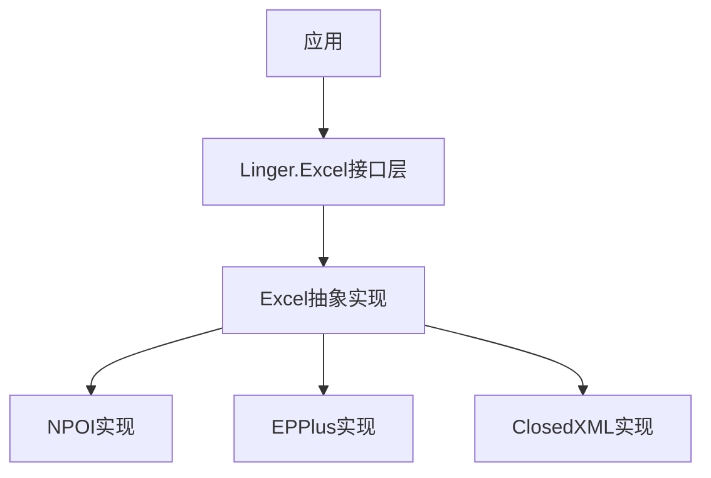

# Linger Excel Framework

> 📝 *查看此文档: [English](./README.md) | [中文](./README.zh-CN.md)*

<div align="center">


一个统一、高效、可扩展的Excel操作框架，支持多种Excel库实现

</div>

## 🚀 特性概览

- **统一接口** - 多种底层实现，开发者无需关心具体细节
- **自动类型映射** - 无缝转换Excel与对象之间的数据
- **依赖注入友好** - 支持.NET Core/ASP.NET Core依赖注入
- **高性能设计** - 批处理、并行处理以及性能监控
- **异步支持** - 全方位异步API支持
- **灵活配置** - 丰富的选项配置系统
- **可扩展性** - 易于自定义和扩展
- **跨平台兼容** - 支持.NET Standard 2.0+、.NET Core 3.1+、.NET 5+

## 📦 支持的Excel实现

| 实现库 | 包名 | 特点 |
|-------|------|-----|
| **NPOI** | `Linger.Excel.Npoi` | 无需Office，支持.xls和.xlsx |
| **EPPlus** | `Linger.Excel.EPPlus` | 高性能，支持更丰富的Excel功能 |
| **ClosedXML** | `Linger.Excel.ClosedXML` | 友好易用的API，性能良好 |

## 🏗️ 架构设计



## 🚀 快速入门

### 1. 安装包

```bash
# 安装核心接口包
dotnet add package Linger.Excel.Contracts

# 安装你选择的实现
dotnet add package Linger.Excel.Npoi
# 或者
dotnet add package Linger.Excel.ClosedXML
```

### 2. 注册服务

```csharp
// 在Startup.cs或Program.cs中
// NPOI实现
services.AddExcelNpoi(options =>
{
    options.DefaultDateFormat = "yyyy-MM-dd";
    options.EnableFormulaEvaluation = true;
});

// 或者使用ClosedXML实现
services.AddExcelClosedXML(options =>
{
    options.DefaultDateFormat = "yyyy-MM-dd";
    options.AutoFitColumns = true;
});
```

### 3. 在服务中使用

```csharp
public class ExcelReportService
{
    private readonly IExcelService _excelService;

    public ExcelReportService(IExcelService excelService)
    {
        _excelService = excelService;
    }

    public List<User> ImportUsers(Stream excelStream)
    {
        return _excelService.ExcelToList<User>(excelStream);
    }

    public byte[] ExportUsers(List<User> users)
    {
        using var ms = new MemoryStream();
        _excelService.ListToExcel(users, ms);
        return ms.ToArray();
    }
}
```

## 📝 核心接口

### IExcel<TWorksheet>

```csharp
public interface IExcel<out TWorksheet> where TWorksheet : class
{
    // 导入功能
    DataTable ExcelToDataTable(string filePath, string sheetName = null);
    DataTable ExcelToDataTable(Stream stream, string sheetName = null);
    List<T> ExcelToList<T>(string filePath, string sheetName = null) where T : class, new();
    List<T> ExcelToList<T>(Stream stream, string sheetName = null) where T : class, new();

    // 导出功能
    void ListToExcel<T>(List<T> data, string filePath, Action<ExcelStyleOptions> styleAction = null) where T : class;
    void ListToExcel<T>(List<T> data, Stream stream, Action<ExcelStyleOptions> styleAction = null) where T : class;
    void DataTableToExcel(DataTable dataTable, string filePath, Action<ExcelStyleOptions> styleAction = null);
    void DataTableToExcel(DataTable dataTable, Stream stream, Action<ExcelStyleOptions> styleAction = null);

    // 工作簿/工作表操作
    object CreateWorkbook();
    TWorksheet GetWorksheet(object workbook, string sheetName);
    TWorksheet AddSheet(object workbook, string sheetName, DataTable data);
    TWorksheet AddSheet<T>(object workbook, string sheetName, List<T> data) where T : class;
    void SaveWorkbook(object workbook, string filePath);
    void SaveWorkbook(object workbook, Stream stream);

    // 模板功能
    void FillTemplate(string templatePath, string outputPath, Dictionary<string, object> data);
    void FillTemplate(Stream templateStream, Stream outputStream, Dictionary<string, object> data);
}
```

### IExcelService

```csharp
public interface IExcelService
{
    // 导入功能
    DataTable ExcelToDataTable(string filePath, string sheetName = null);
    DataTable ExcelToDataTable(Stream stream, string sheetName = null);
    List<T> ExcelToList<T>(string filePath, string sheetName = null) where T : class, new();
    List<T> ExcelToList<T>(Stream stream, string sheetName = null) where T : class, new();

    // 导出功能
    void ListToExcel<T>(List<T> data, string filePath, Action<ExcelStyleOptions> styleAction = null) where T : class;
    void ListToExcel<T>(List<T> data, Stream stream, Action<ExcelStyleOptions> styleAction = null) where T : class;
    void DataTableToExcel(DataTable dataTable, string filePath, Action<ExcelStyleOptions> styleAction = null);
    void DataTableToExcel(DataTable dataTable, Stream stream, Action<ExcelStyleOptions> styleAction = null);

    // 模板功能
    void FillTemplate(string templatePath, string outputPath, Dictionary<string, object> data);
    void FillTemplate(Stream templateStream, Stream outputStream, Dictionary<string, object> data);
}
```

## 🎨 高级功能

### 自定义Excel列映射

使用特性来控制如何将对象属性映射到Excel列：

```csharp
public class User
{
    [ExcelColumn(Index = 0, Name = "用户ID")]
    public int Id { get; set; }

    [ExcelColumn(Index = 1, Name = "用户名")]
    public string Username { get; set; }

    [ExcelColumn(Index = 2, Name = "邮箱地址", Width = 30)]
    public string Email { get; set; }

    [ExcelColumn(Index = 3, Name = "注册日期", Format = "yyyy年MM月dd日")]
    public DateTime RegistrationDate { get; set; }

    [ExcelColumn(Ignore = true)]
    public string Password { get; set; }
}
```

### Excel样式自定义

```csharp
excelService.ListToExcel(users, "users.xlsx", options =>
{
    // 表头样式
    options.HeaderBackgroundColor = "#1E90FF"; // 深蓝色
    options.HeaderFontColor = "#FFFFFF";       // 白色
    options.HeaderFontBold = true;
    options.HeaderFontSize = 12;

    // 内容样式
    options.ContentFontName = "微软雅黑";
    options.ContentFontSize = 10;

    // 行交替颜色
    options.AlternatingRowBackgroundColor = "#F0F8FF"; // 淡蓝色

    // 条件样式
    options.AddConditionalFormat(nameof(User.Status), "=Active", cellFormat =>
    {
        cellFormat.BackgroundColor = "#E6FFE6"; // 淡绿色
    });
});
```

### 大数据处理

```csharp
// 启用分批处理以处理大型数据集
excelService.ListToExcelAsync(
    hugeDataList, 
    "huge_data.xlsx", 
    batchSize: 10000, 
    parallelProcessing: true,
    progress: new Progress<int>(percent => 
    {
        Console.WriteLine($"已完成: {percent}%");
    })
);
```

### Excel模板填充

```csharp
// 使用模板并填充数据
var templateData = new Dictionary<string, object>
{
    ["ReportTitle"] = "月度销售报告",
    ["GeneratedDate"] = DateTime.Now,
    ["SalesData"] = salesDataList,
    ["TotalAmount"] = salesDataList.Sum(s => s.Amount)
};

excelService.FillTemplate("template.xlsx", "report.xlsx", templateData);
```

## 🧩 扩展性

### 自定义Excel实现

```csharp
public class MyCustomExcel : ExcelBase<MyWorkbook, MyWorksheet>
{
    public MyCustomExcel(ExcelOptions options = null) : base(options) { }

    // 实现基类要求的方法...
}

// 注册自定义实现
services.AddExcel<MyCustomExcel>();
```

### 事件钩子

```csharp
excelService.BeforeExcelExport += (sender, args) =>
{
    Console.WriteLine($"准备导出Excel: {args.FilePath}");
};

excelService.AfterExcelImport += (sender, args) =>
{
    Console.WriteLine($"已完成导入Excel，共{args.RowCount}行数据");
};
```

## 📊 性能对比

| 实现 | 10K行导出 | 50K行导出 | 10K行导入 | 内存占用 |
|------|-----------|-----------|-----------|----------|
| NPOI | 1.2秒 | 5.8秒 | 0.9秒 | 中等 |
| EPPlus | 0.8秒 | 3.4秒 | 0.6秒 | 较高 |
| ClosedXML | 1.0秒 | 4.7秒 | 0.8秒 | 较低 |

_注：性能测试结果可能因硬件配置和数据复杂度而异_

## 📜 许可证

MIT
